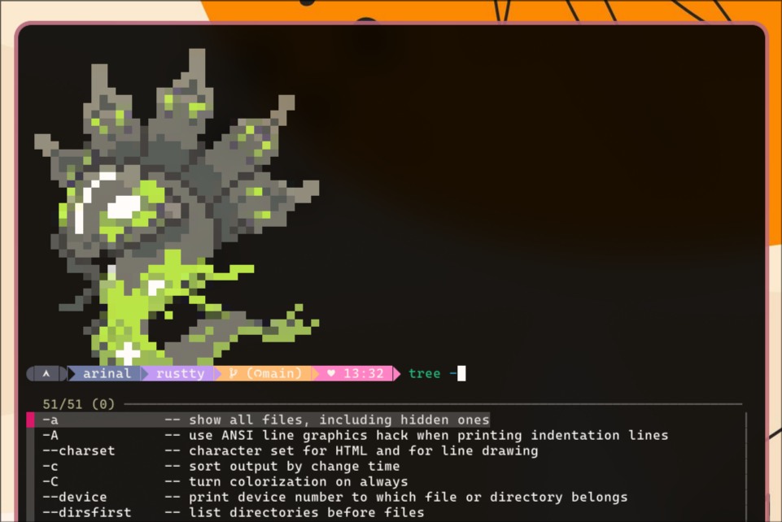
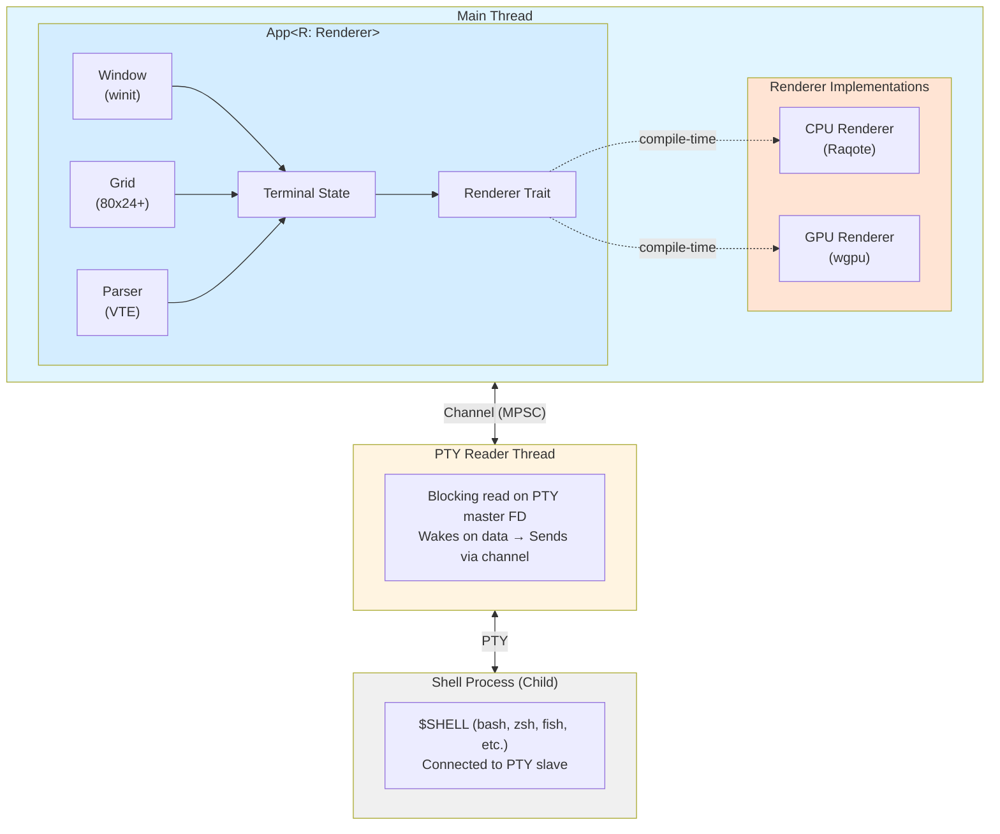

# Rustty Terminal Emulator

A modern terminal emulator written in Rust with both CPU and GPU rendering options and efficient event-driven architecture.

**What will make Rustty different?** Planned smooth pixel-level scrolling, similar to NeoVide. Unlike traditional terminal emulators that scroll by whole character lines, Rustty will enable buttery-smooth scrolling animations.



## Features

- ❌ **Smooth Pixel-Level Scrolling** (Planned) - Unlike traditional terminals (1-line scroll resolution), Rustty will scroll smoothly at the pixel level, inspired by NeoVide
- ✅ **Full PTY Support** - Runs your shell with proper pseudo-terminal integration
- ✅ **ANSI Escape Sequences** - Full 256-color palette + RGB true color support
- ✅ **Alternate Screen Buffer** - Full-screen apps (vim, less, htop) work correctly
- ✅ **Event-Driven Architecture** - Dedicated reader thread for near-zero CPU usage when idle
- ✅ **Dynamic Grid Sizing** - Terminal grid resizes with window, preserving content
- ✅ **Scrollback Buffer** - 10,000 line scrollback history
- ✅ **Dual Rendering Options** - Choose between CPU (Raqote) or GPU (wgpu) rendering
- ✅ **Keyboard Input** - Full keyboard support including arrow keys, function keys, and Ctrl combinations

## Architecture

### Core Components



### Module Breakdown

Rustty is organized as a **library + binary**:

**Library** (`src/lib.rs` + `src/terminal/` + `src/renderer/`):
- **Terminal emulation** with zero UI dependencies (`src/terminal/`, ~1500 lines)
- **Renderer abstractions** (`src/renderer/`, ~1200 lines)
  - Generic `App<R: Renderer>` for shared application logic
  - `Renderer` trait with CPU and GPU implementations
  - Input handling (keyboard, mouse, paste, focus)
- Exports: `Terminal`, `Shell`, `TerminalGrid`, `Cell`, `Color`, `CpuRenderer`, `GpuRenderer`, etc.
- Can be used to build custom terminal UIs

**Binary** (`src/bin/main.rs` with conditional compilation):
- **Single unified binary** - Selects renderer at compile time via feature flags
- **CPU implementation** (`src/bin/ui/cpu_ui.rs`) - Uses Raqote + Softbuffer
- **GPU implementation** (`src/bin/ui/gpu_ui.rs`) - Uses wgpu
- Both implementations use shared `App<R>` from library, minimal duplication

**Terminal modules** (`src/terminal/`):
- **`mod.rs`** - Terminal struct with VTE Perform implementation
- **`shell.rs`** - Shell process management + PTY + reader thread
- **`grid.rs`** - Terminal grid data structure with scrollback buffer
- **`command.rs`** - ANSI command enums (CsiCommand, SgrParameter, etc.)
- **`color.rs`** - Color representation and ANSI color palette
- **`cursor.rs`** - Cursor positioning
- **`state.rs`** - Terminal state (pure data structure)

**Renderer modules** (`src/renderer/`):
- **`mod.rs`** - `Renderer` trait definition and module declarations
- **`app.rs`** - `App<R>` generic application struct and `AppBase`
- **`input.rs`** - Input handlers (keyboard, mouse, clipboard, focus)
- **`cpu/`** - CPU renderer module
  - **`mod.rs`** - Main CpuRenderer implementation (Raqote)
  - **`drawing.rs`** - Drawing primitives and helpers
- **`gpu/`** - GPU renderer module
  - **`mod.rs`** - Main GpuRenderer implementation (wgpu)
  - **`vertex.rs`** - Vertex structure and layout
  - **`glyph_atlas.rs`** - Texture atlas for font rendering
  - **`shaders/terminal.wgsl`** - WGSL shader code

## Building

### Prerequisites

- Rust 1.80+ (Rust 2024 edition)
- Linux/Unix system with PTY support
- System libraries:
  - `fontconfig`
  - `freetype`

### Rendering Backends

Rustty offers two rendering backends via Cargo feature flags, compiled into a single binary:

**CPU Renderer** - Default
- Uses Raqote for software rendering
- Better compatibility (works on all systems)
- Lower memory usage
- Good for general use

**GPU Renderer**
- Uses wgpu for hardware-accelerated rendering
- Better performance on large windows
- Foundation for future smooth scrolling
- Requires GPU drivers

### Build Commands

**CPU Renderer (Default):**
```bash
# Build with CPU renderer (or just use default)
cargo build
cargo build --features ui-cpu --no-default-features

# Run CPU renderer
cargo run
cargo run --features ui-cpu --no-default-features

# Release build
cargo build --release
```

**GPU Renderer:**
```bash
# Build with GPU renderer
cargo build --features ui-gpu --no-default-features

# Run GPU renderer
cargo run --features ui-gpu --no-default-features

# Release build
cargo build --features ui-gpu --no-default-features --release
```

**Testing:**
```bash
# Run tests (library tests, no UI)
cargo test

# Build library only (no binary, no UI dependencies)
cargo build --lib

# Build with all features
cargo build --all-features
```

## Usage

### Running the Terminal Emulator

Simply run the terminal:

```bash
cargo run
```

The terminal will:
1. Launch your default `$SHELL` (or `/bin/sh` as fallback)
2. Create an 800x600 window
3. Automatically resize the grid when you resize the window
4. Support full keyboard input and terminal output

### Using the Library

The `rustty` library can be used to build custom terminal UIs:

```rust
use rustty::{Terminal, Shell};

fn main() -> anyhow::Result<()> {
    // Create terminal and shell
    let mut terminal = Terminal::new(80, 24);
    let shell = Shell::new(80, 24)?;

    // Process shell output
    loop {
        match shell.receiver.try_recv() {
            Ok(data) => {
                terminal.process_bytes(&data);

                // Get terminal state for rendering
                let viewport = terminal.state().grid.get_viewport();
                // ... custom rendering logic
            }
            Err(_) => break,
        }
    }

    Ok(())
}
```

The library has zero UI dependencies - only PTY and ANSI parsing.

### Keyboard Shortcuts

- **Arrow Keys** - Navigate (sends `\x1b[A/B/C/D`)
- **Enter** - Carriage return (`\r`)
- **Backspace** - Delete (`\x7f`)
- **Tab** - Tab completion (`\t`)
- **Ctrl+C, Ctrl+D, etc.** - Standard control codes
- **Function Keys** - Home, End, Page Up/Down, Insert, Delete

## Performance

### Event-Driven PTY Reading

Rustty uses a dedicated reader thread for PTY I/O:

- **Blocking reads** in separate thread - sleeps when no data available
- **Channel-based** communication to main thread
- **Near-zero CPU** usage when terminal is idle
- **Instant response** when data arrives (no polling delay)

This is the same architecture used by production terminals like **Alacritty** and **WezTerm**.

### Benchmarks

- Idle CPU usage: **< 0.1%**
- Input latency: **< 5ms**
- Scrollback: **10,000 lines**
- Grid resize: **Preserves all content**

## Testing

Rustty includes comprehensive unit tests:

```bash
$ cargo test
```

**Test Coverage:**
- ✅ 53 passing tests
- Color module (11 tests)
- Grid module (18 tests)
- Parser module (11 tests)
- App module (13 tests)

## Technical Details

### Grid System

- **Dynamic sizing** - Calculates optimal grid based on window dimensions
- **Content preservation** - Resizing doesn't lose terminal content
- **Scrollback buffer** - Configurable (default: 10,000 lines)
- **Viewport management** - Efficient rendering of visible region only

### ANSI Support

**Implemented:**
- ✅ Full 256-color palette (colors 0-255)
  - Standard 16 colors (0-15)
  - 6×6×6 RGB cube (16-231)
  - Grayscale ramp (232-255)
- ✅ RGB true color (`ESC[38;2;R;G;Bm`)
- ✅ Cursor movement (H, f, A, B, C, D)
- ✅ Screen/line clearing (J, K)
- ✅ SGR (Select Graphic Rendition)
- ✅ Alternate screen buffer (`ESC[?1049h/l`)

**Not Yet Implemented:**
- ✅ Bold text rendering (brightens foreground color)
- ✅ Italic text rendering (adds cyan tint)
- ✅ Underline rendering (draws line below text)
- ❌ Mouse support

### Rendering Pipeline

```
PTY Output → VTE Parser → Terminal Grid → Raqote → Softbuffer → Window
```

1. **PTY Thread** reads shell output (blocking)
2. **Channel** transfers data to main thread
3. **VTE Parser** interprets ANSI sequences
4. **Terminal Grid** stores characters and attributes
5. **Raqote** renders text to pixel buffer (CPU)
6. **Softbuffer** presents buffer to window

## Documentation

For detailed information, see the following documentation:

- **[Terminal Fundamentals](docs/terminal-fundamentals.md)** - Complete guide to how terminal emulators work (PTY, shells, file descriptors, Rustty architecture)
- **[Window System](docs/window-system.md)** - Window management, sizing, rendering pipelines, and keyboard input handling
- **[ANSI Implementation](docs/ansi-implementation.md)** - Complete reference of supported ANSI escape sequences
- **[Debugging Guide](docs/debugging.md)** - How to debug and trace ANSI sequences

## Testing Colors

Test the 256-color palette support:

```bash
# Run inside Rustty terminal
./test-256-colors.sh
```

## Future Improvements

### Short-term
- [x] Full 256-color palette support ✨
- [x] Alternate screen buffer ✨
- [x] Bold text rendering ✨
- [x] Italic text rendering ✨
- [x] Underline rendering ✨
- [x] Cursor blinking animation ✨
- [x] Cursor styles (block, underline, bar) ✨
- [x] Scrolling regions (DECSTBM) ✨
- [x] Insert/Delete Line operations ✨
- [x] Mouse support (modes 1000, 1002, 1006) ✨ **NEW!**
- [x] Bracketed paste mode ✨ **NEW!**
- [x] Focus events ✨ **NEW!**
- [x] Application cursor keys ✨ **NEW!**
- [ ] Selection support

### Long-term
- [x] GPU rendering with wgpu ✨ **NEW!**
- [ ] **Smooth pixel-level scrolling** (inspired by NeoVide) - Will leverage GPU renderer
- [ ] Configuration file support
- [ ] Mouse support (SGR mouse mode)
- [ ] Ligature support
- [ ] Image rendering (sixel, iTerm2 protocol)

## Dependencies

### Library Dependencies (Terminal Emulation)
- **`nix`** - Unix PTY and process management
- **`vte`** - ANSI escape sequence parser
- **`anyhow`** - Error handling

### Shared Binary Dependencies
- **`winit`** - Cross-platform window creation
- **`font-kit`** - Font loading and metrics

### CPU Binary Dependencies (`rustty`)
- **`raqote`** - 2D graphics rendering (CPU-based)
- **`softbuffer`** - Software rendering backend

### GPU Binary Dependencies (`rustty-gpu`)
- **`wgpu`** - WebGPU API for hardware-accelerated rendering
- **`pollster`** - Async executor for wgpu initialization
- **`bytemuck`** - Safe type casting for GPU buffers
- **`pathfinder_geometry`** - Geometric primitives for glyph rasterization

## License

This project is open source and available under the MIT License.

## Acknowledgments

- Inspired by [Alacritty](https://github.com/alacritty/alacritty) and [WezTerm](https://github.com/wez/wezterm)
- Uses the excellent [VTE](https://github.com/alacritty/vte) parser from the Alacritty project
- Built with the Rust 2024 edition

---

**Status:** Early development - functional but missing some features
